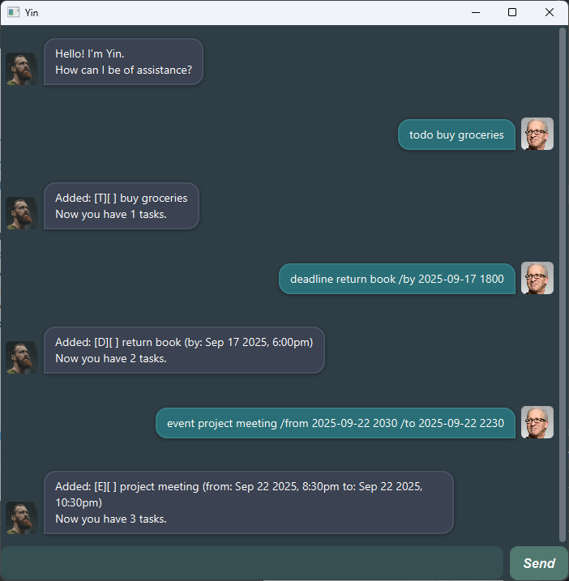

# Yin User Guide



Welcome to **Yin**, your friendly task manager chatbot with a GUI. Yin helps you manage your tasks in a chat-style interface, so you can focus on what matters.

## Adding a Todo

Adds a simple task without date/time.

**Format:**  
`todo <description>`

**Example:**  
`todo buy groceries`

Returns the task you added, and the number of tasks in your list.

```
Added: [T][ ] buy groceries
Now you have 1 tasks.
```

## Adding deadlines

Adds a task with deadline date and/or time.

**Format:**  
`deadline <description> /by <yyyy-mm-dd> [hhmm]`

**Example:**  
`deadline return book /by 2025-09-17 1800`

Returns the task you added along with its deadline, and the number of tasks in your list.

```
Added: [D][ ] Return book (by: Sep 17 2025, 6:00pm)
Now you have 2 tasks.
```

## Adding events

Adds an event with a specific duration with date and/or time.

**Format:**  
`event <description> /from <yyyy-mm-dd> [hhmm] /to <yyyy-mm-dd> [hhmm]`

**Example:**  
`event project meeting /from 2025-09-22 2030 /to 2025-09-22 2230`

Returns the task you added along with its deadline, and the number of tasks in your list.

```
Added: [E][ ] Project meeting (from: Sep 22 2025 8:30pm to: Sep 22 2025, 10:30pm)
Now you have 3 tasks.
```

## Listing tasks

Displays all tasks currently stored.

**Format:**  
`list`

Example:  
`list`

Returns the current list of tasks, the type of task, and whether they have been marked done or not.

```
Here are your tasks:
1. [T][ ] buy groceries
2. [D][ ] return book (by: Sep 17 2025, 6:00pm)
3. [E][ ] project meeting (from: Sep 22 2025 8:30pm to: Sep 22 2025 10:30pm)
```

## Marking a task as done

Marks a task as completed.

**Format:**  
`mark <task number>`

**Example:**  
`mark 1`

Returns the task you marked as done. 

```
Marked done:
[T][X] buy groceries
```

## Unmarking a task

unmarks a task that was marked as completed.

**Format:**  
`unmark <task number>`

**Example:**  
`unmark 1`

Returns the task you unmarked.

```
Unmarked:
[T][ ] buy groceries
```

## Deleting a task

Removes a task from the list.

**Format:**  
`delete <task number>`

**Example:**  
`delete 1`

Returns the task you deleted, and the number of tasks left in your list.

```
Removed: [T][ ] buy groceries
Now you have 2 tasks.
```

## Finding a task

Searches for tasks containing a keyword.

**Format:**  
`find <keyword>`

**Example:**  
`find book`

Returns the list of tasks that matches the keyword.

```
Matching tasks:
[T][ ] return book (by: Sep 17 2025, 6:00pm) 
```

## Archiving tasks

Moves tasks to an archive (can be all tasks or only completed ones).

**Format:**  
`archive <all/done>`

**Example:**  
`archive all`  
`archive done`

Returns the number of tasks you archived, and specifies if all or only completed tasks are archived.

```
Archived 2 task(s) (all).
```

## Adding a Todo

Adds a simple task without date/time.

**Format:**  
`todo <description>`

**Example:**  
`todo buy groceries`

Returns the task you added, and the number of tasks in your list.

```
Added: [T][ ] buy groceries
Now you have 1 tasks in the list.
```

## Exiting the app

Closes Yin.

**Format:**  
`bye`

**Example:**  
`bye`

Returns a farewell message.

```
See you later alligator.
```